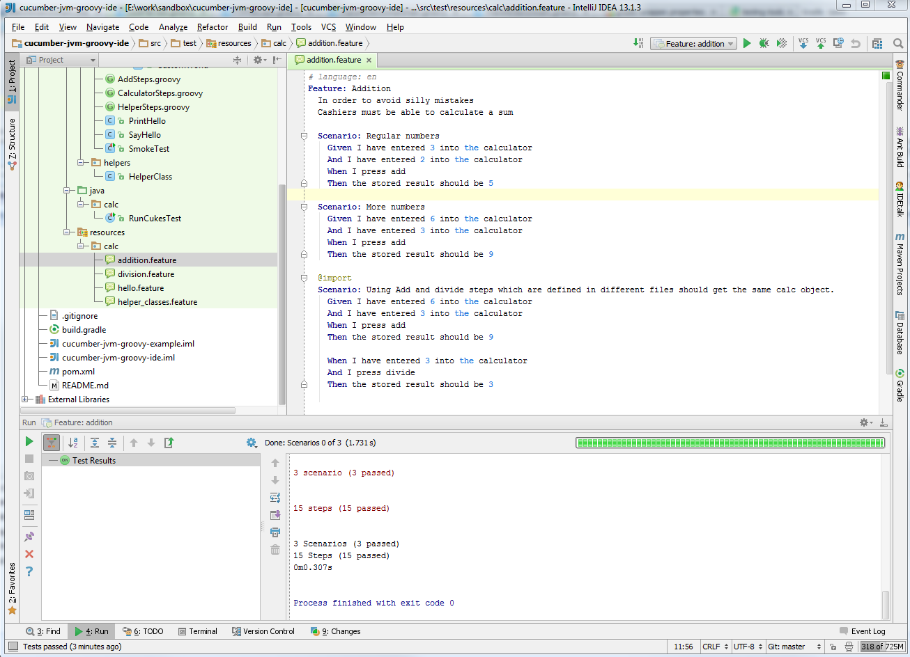
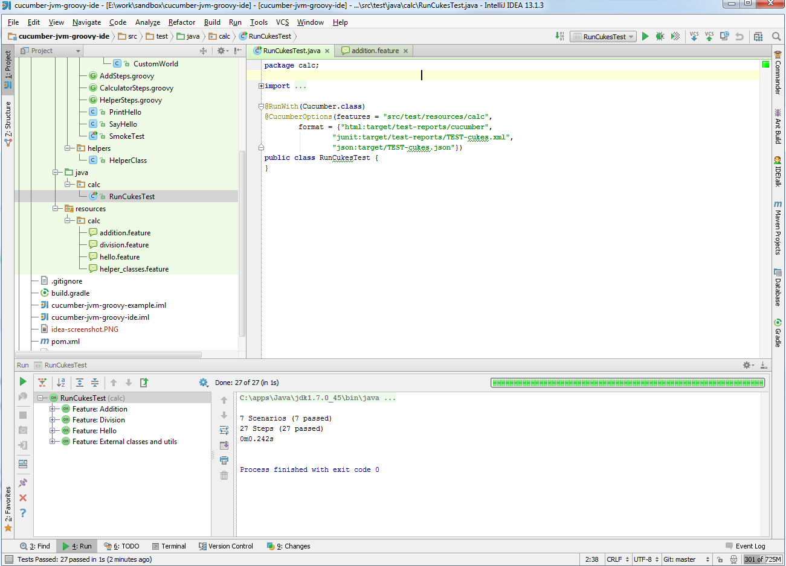

## Cucumber-JVM in Groovy with IDE integration and more

This project represents the distillation of my experience with Cucumber-JVM and what I consider best practise for self-contained, easy to create and run, automated tests driven by Specification By Example. I have used this model to create scheduled, automated tests which can test our project deployed in any environment, even smoke test a new production release.    

This is an example for how to create cucumber-jvm groovy projects which are more friendly in the IDE, specifically JetBrains IntelliJ IDEA!
* The steps files can share state via CustomWorld, which is nice for keeping your step defs tidy
* Groovy mixins make the above sharing explicit, used in each step def files, so your IDE can find the correct objects for autocompletion, instead of trusting Cucumber's magic
* Allows you to run features or Cucumber junit tests directly in IntelliJ from version 13, which is quite nice!
 
Forked from https://github.com/dkowis/cucumber-jvm-groovy-example in order to demonstrate more advanced setup.

### Screenshots

### Requirements
 * Java 1.6+
 * Maven: v2 up, as far as I know any should work
 * cucumber-jvm: taken care of by dependencies (1.1.6 currently)
 * Gradle (optional): 1.7 

### Installation

* Check out source code from github, and because of the proxy you should follow the guide at 503 error while accessing stash.int.corp.sun or github
* Build it on command line first - mvn clean install
* Might as well get it working in gradle too if you have it installed - gradle clean build
* Then import into IntelliJ (v13) by pom.xml

### Usage

 * Open a .feature file, right click on it and hit Run (or Ctrl-Shift F10) 
 * Alternatively, run the RunCukesTest file to run all cucumber features
 * * Or add a tags = { "@yourtag", "~@broken" } to the @CucumberOptions annotation to run specific tagged scenarios
 * Test also run as part of mvn verify phase (as opposed to test)

The project I forked from used gradle to run cucumber, but either way you run it doesn't work:
* "gradle cucumber" uses javaexec to call the cucumber Main class with glue options, as well as a classpath hack, but this doesn't seem to be able to find classes within a groovy script, ie CustomWorld, so it fails.
* "gradle test" runs RunCukesTest, but this fail because "It's XML output mechanism that it uses for executing the Junit tests doesn't like to make files named 'Scenario: Regular Numbers.xml'"

Therefore I added a pom.xml and "mvn clean install" works fine. I hope to get gradle working in future. 

This pom.xml also contains a number of other examples and optional code. I move cucumber execution to the verify phase so I can run a sanity check in the test phase and stop there if the environment is down rather than get a bunch of bad test results. 

There are options in RunCukesTest to create a HTML report, and JUnit XML and JSON output, which can be used in Jenkins like any JUnit results.

### To do 

* Describe more of the specific features of this example, and why they are important/rationale
* Get it working in gradle, get rid of maven

